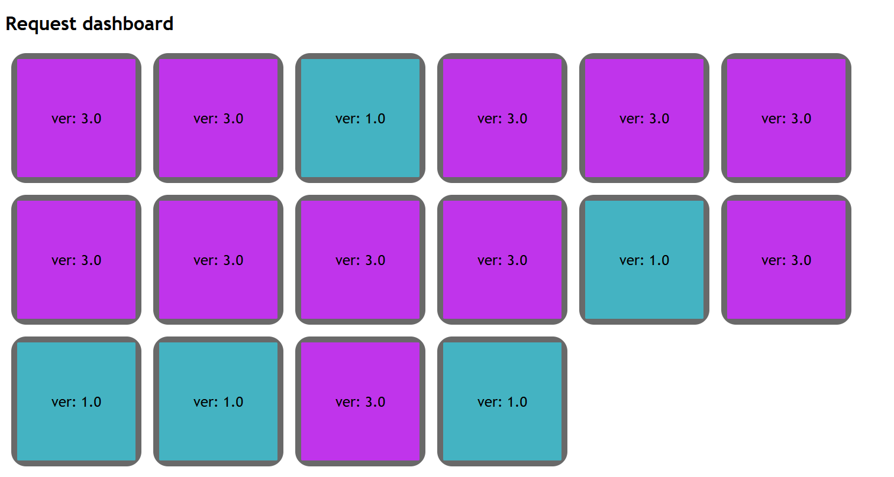

<<<<<<< HEAD
# summer-of-k8s-app
=======
# Summer of Kubernetes Argo rollouts example

This is an example application to be used for Argo Rollouts 
in the [summer of K8s program](https://www.getambassador.io/summer-of-k8s/)

It is simple application that consists of one container.

It performs multiple requests in a single dashboard
exposed at port 8080.

## How to run locally

`go run .`

then visit http://localhost:8080 in your browser

## How to build and run container

Run

 *  `docker build . -t my-app` to create a container image 
 *  `docker run -p 8080:8080 my-app` to run it

 then visit http://localhost:8080 in your browser

You can find prebuilt images at [https://hub.docker.com/r/kostiscodefresh/summer-of-k8s-app/tags](https://hub.docker.com/r/kostiscodefresh/summer-of-k8s-app/tags)

## Deploying to Kubernetes

You can find the associated manifests at [https://github.com/kostis-codefresh/summer-of-k8s-app-manifests](https://github.com/kostis-codefresh/summer-of-k8s-app-manifests)

>>>>>>> v1
